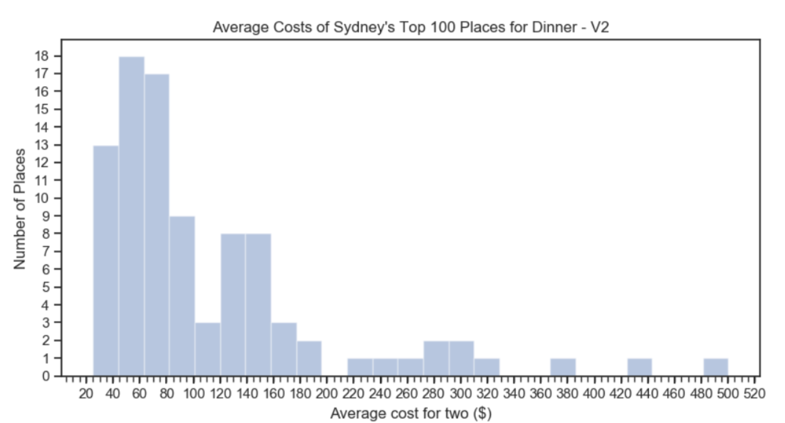

# Zomato Restaurants
What is the average price of having dinner at one of Sydney's Top 100 restaurants? Have a guess before you find out the answer below!

**(For a full detailed guide, please have a look at my Medium article)**

In this README we will **briefly** go through an example to: 
1. Extract data using the Zomato API
2. Transform it into a consumable and readable format
3. Make sense of the data (by applying some descriptive statistics)

### What is Zomato?
It is a platform that holds information on over 1 million restaurants globally, including ratings, reviews and many more. It is a place that I visit before checking out a new place to eat, or even after going to one I've tried (just to see what everyone else thinks of it).

### The Zomato API
To get started with the Zomato API, you first need to [request an API key](https://developers.zomato.com/api?lang=id). Once that's done head on over to the _Documentations_ section and have a look at all the data points you can begin to source!

# Example: Top 100 places for dinner in Sydney
So with this example we're trying to find what is the average price to eat dinner in one at Sydney's top 100 places. Before we answer this question, we should think about what data points we need.
1. By what means are we ranking the Top 100? We will be ranking it by the restaurant's _rating_
2. How do we get the average price? We will need some sort of cost value.

These will be our key data points.

## 1. Extract data using the Zomato API
As I will be sourcing data about each restaurant I use the _/search_ function. This function takes many parameters which were found by using functions such as:
* /locations: To source the _latitude_ and _longitude_ coordinates for "Sydney".
* /category: To source the ID = 10 for the "Dinner" category.

To retrieve the Top 100 restaurants, we needed to sort by _rating_ and specify the order as _desc_. 

The /search function only returns a maximum of 20 restaurants per call, with a maximum total of 100 restaurants. As a result each dictionary returned was appended to a list which was then dumped into a JSON file for consumption later on.

See [ZomatoJsonDump.py](https://github.com/trinhjorwe/zomato-restaurants/blob/master/ZomatoJsonDump.py)

> A big thanks to https://github.com/fatihsucu/pyzomato for providing a Python Wrapper to access the Zomato API!

## 2. Transform it into a consumable and readable format
Our aim in this section will be to get the JSON formatted data into a simple-to-read tabular format. We deconstruct the JSON , by iterating through the list of dictionaries, source our interested values from each dictionary and append it as a new row to a DataFrame.

See  [ReadZomatoJSON.py](https://github.com/trinhjorwe/zomato-restaurants/blob/master/ZomatoJsonDump.py)

## 3. Make sense of the data (by applying some descriptive statistics)
Here we attempt to answer our first question "What is the average price of having dinner at one of Sydney's Top 100 restaurants?". We find that the average cost for two is $107.90, however 66% of the total restaurants lie below this value.
Does this appropriately describe the central tendency of the data? Maybe but to confirm lets do some more investigation.

As a result we plot this on a histogram to visualise our data.

You can see the data is significantly skewed to the right, which indicates it would be more appropriate to use the median as our measure of central tendency. We then find the median to be $80.00 with 48% of values to be below the median, this looks to be the more appropriate measure of central tendency.

HOWEVER - after plotting the data it is evident that there is are a few values sitting around the $20 mark, and seems to be unusually low. This warrants some deeper investigation.

### 3.1 Investigating outliers
To do so, we grabbed the 10 lowest cost restaurants based on _average_cost_for_two_ and investigated them:

Evidently the _cuisines_ column included values for "Ice Cream", "Cafe Food" and "Cofee and Tea", which meant these restaurants were in fact cafes/desert parlours and not places for dinner (unless you have ice cream for dinner...). We filted out these places hence reducing our dataset to 92 restaurants.

### Let's compute some descriptive statistics again, now that our data has been cleaned...
Our median is still $80.00, but with only 43.48% of values being below the median. Funnily enough our median hasn't changed, which is a good thing! As it reinforces it's insensitivity to outliers unlike the mean. If we visualise the distribution again:

Now we have no more values that are below the $20 mark!

## Finally...
This marks the end of my brief walkthrough, if this was not detailed enough please refer to my Medium article.
Otherwise if you have any questions or suggestions for improvement let me know as i'd be more than happy to hear about it!

Thanks!

